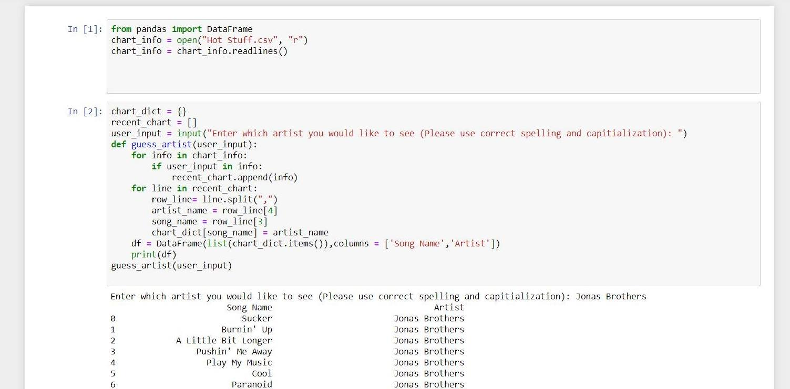
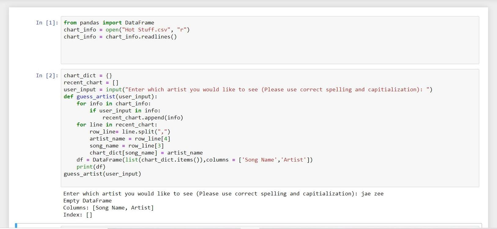

# Billboard Top 100 Python Project
For this project, my goal is to create a program that prints out a chart that lists the musical artist name and the songs he or she made that are featured from the Billboard Top 100 chart from all time based on the user entering the artist's name.

The program itself essentially accesses the csv file HotStuff.csv which contains the Billboard Top 100 chart from all time and then a function is created to store the csv file into Pandas DataFrame and then print out a chart based on the artist's name that the user enters. If the user spells the artist's name wrong they will be told to try again. 

Unfortunately the CSV file is too big to upload on github so the CSV file is unable to be shown.  

# Result when the user enters in their chosen artist.

# Result when the user mispells their chosen artist.

